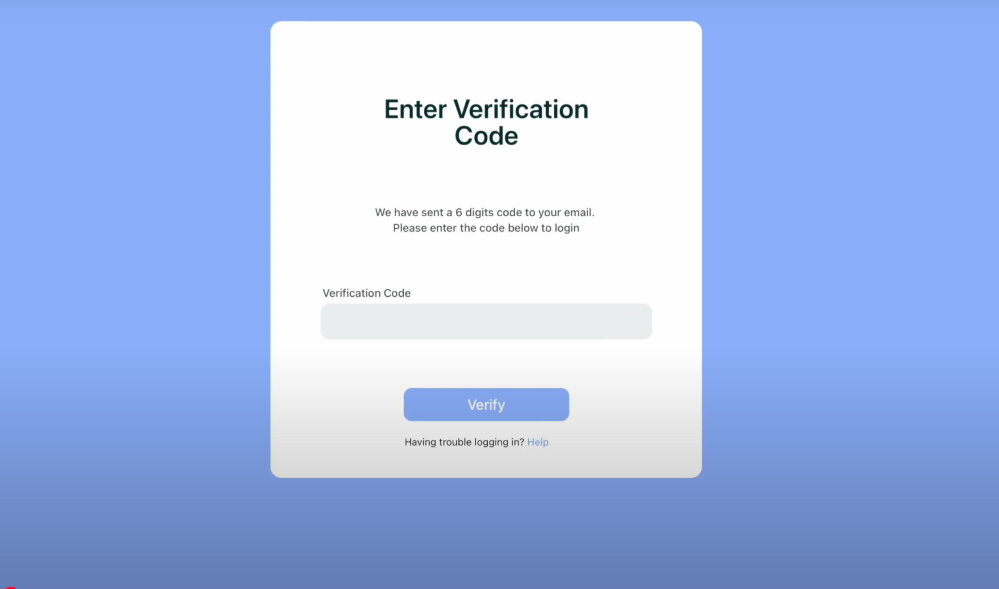
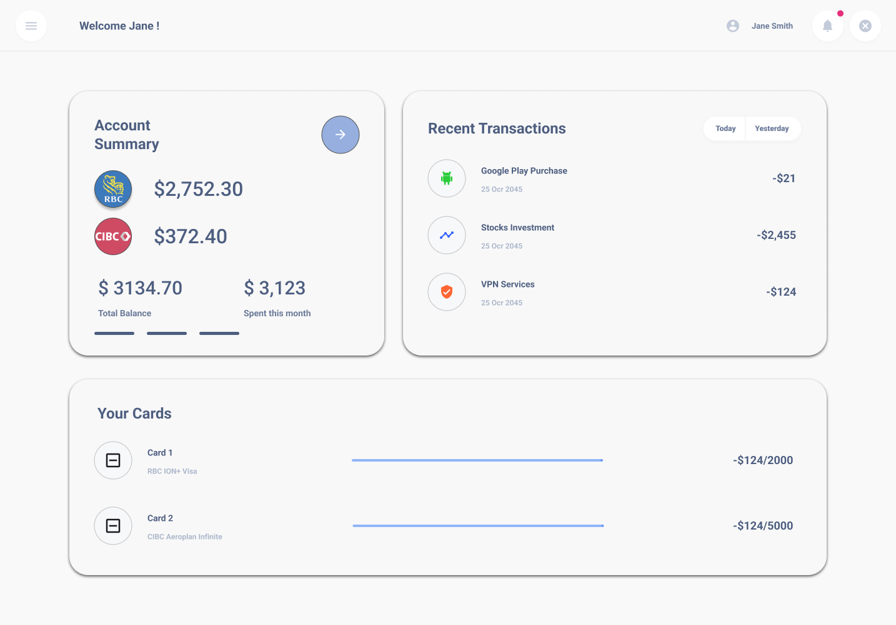

# Alloy — Linked Banking & Social Web App

A full-stack web application prototype built during **DeltaHacks IX** (36-hour hackathon at McMaster University). Alloy connects banking functionality with social features — enabling users to manage finances collaboratively and transparently.

> 🗓️ Hackathon: DeltaHacks IX (Jan 2023)  
> 🛠️ Stack: Java 19, Tomcat 8.5, MariaDB, Maven

---


## 📸 Demo Screenshots
### Login Screen


### Verification Code Screen


### Transaction Table


### Dashboard Overview


## 🌐 Features

### ✅ Banking System
- Create and manage personal bank accounts
- Perform transactions (debit/credit)
- Bank account objects stored and linked to users

### ✅ User System
- Store extended user details (address, gender, etc.)
- User profiles integrated with banking and social modules

### ✅ Authentication & DB Integration
- Secure session support (via Tomcat session handling)
- Centralized SQL connection via factory class
- User-backed login support (DB-auth implied)

### ✅ Social / Forum System
- Users can create forum-style posts and comment
- Boards and categories supported for post grouping

### ✅ Modular Architecture
- Split into logical packages: banking, posts, users
- Built with extensibility in mind using `libhyextended` utilities

---

## 🧰 Tech Stack

| Layer       | Technology        |
|-------------|-------------------|
| Language    | Java 19           |
| Backend     | Apache Tomcat 8.5 |
| Database    | MariaDB           |
| Build Tool  | Maven             |
| Dependencies| `libhyextended` (custom JAR) |
| IDE         | IntelliJ IDEA     |

---

## ⚙️ Setup Instructions

### 1. Clone the repo
```bash
git clone https://github.com/koda-git/alloy.git
cd alloy
```

### 2. Configure the Database
- Run the schema file:
  ```sql
  SOURCE sqlbuild.sql;
  ```
- Schema name: `henryford`

### 3. Build and Run
```bash
./mvnw clean install
```

- Deploy `target/*.war` to Tomcat or run via IDE.

---

## 🗃️ Project Structure

```
src/
├── main/
│   ├── java/              # Core logic
│   ├── resources/         # Config and assets
│   └── webapp/            # JSP files and static assets
sqlbuild.sql               # SQL schema for MariaDB
libhyextended.jar          # Custom Java library (external)
pom.xml                    # Maven config
```

---

## 🤝 Team & Credits

Built with ❤️ during DeltaHacks IX by a team of McMaster students.  
Custom Java modules via [`libhyextended`](https://github.com/410-dev/libhyextended)

---

## 📝 License

MIT © [koda-git](https://github.com/koda-git)
